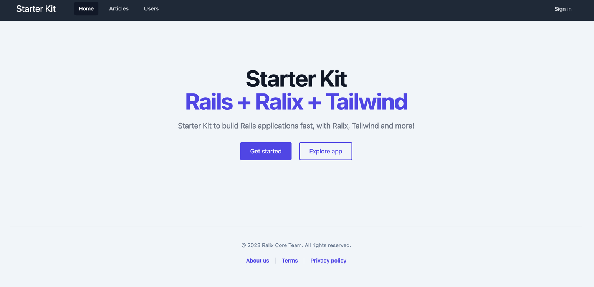
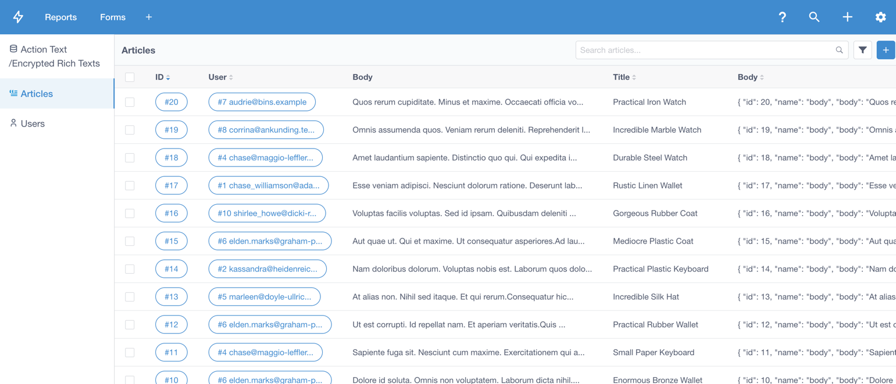

# 🚀 Rails + Ralix + Tailwind

> Starter Kit to build modern Rails applications fast

> Fork of https://github.com/ralixjs/rails-ralix-tailwind



Powered by:

- [Rails](https://rubyonrails.org)
- [Ralix](https://github.com/ralixjs/ralix)
- [Tailwind CSS](https://tailwindcss.com)
- [PostgreSQL](https://www.postgresql.org)
- [Turbo](https://turbo.hotwired.dev)
- [esbuild](https://esbuild.github.io)
- [Admin](https://www.getmotoradmin.com/ruby-on-rails)

Rails v7 application template ready to start building your next project, with a pre-configured modern front-end stack and some extras:

- 🎨 Minimalistic and responsive, clean layout
- 📦 Icons pack, via [Heroicons](https://heroicons.com)
- 🔐 Authentication, via [Devise](https://github.com/heartcombo/devise) + [OmniAuth](https://github.com/omniauth/omniauth) for Social Logins
- 👥 Authorization, via [CanCanCan](https://github.com/CanCanCommunity/cancancan)
- 🔍 Searching, via [Ransack](https://github.com/activerecord-hackery/ransack)
- 📝 Rich text edition, via [Trix](https://trix-editor.org)
- 🔢 Pagination, via [Pagy](https://github.com/ddnexus/pagy)
- 🏵️ Admin dashboard, via [MotorAdmin](https://www.getmotoradmin.com/ruby-on-rails)
- 📄 Static pages controller (About, Terms, ...)
- 🔴 Custom errors pages: 404, 422, 500
- 📚 *Ready-to-use* components: Tables, Buttons, Forms, Cards, Modals and Tooltips

## Install

Clone this repository (or use the GitHub *template* button), then `cd` into the folder and run:

```
> bin/setup
```

## Run

Start the development server:

```
> bin/dev
```

## Usage

### Admin
Admin dashboard is available at `/super_admin` path. you can change in `routes.rb` file.

